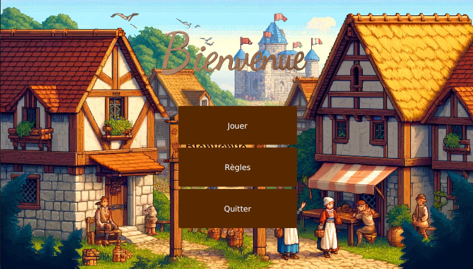
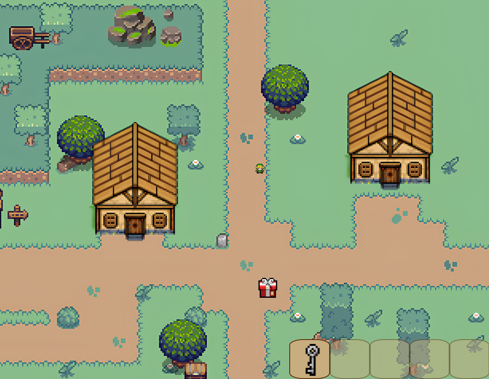
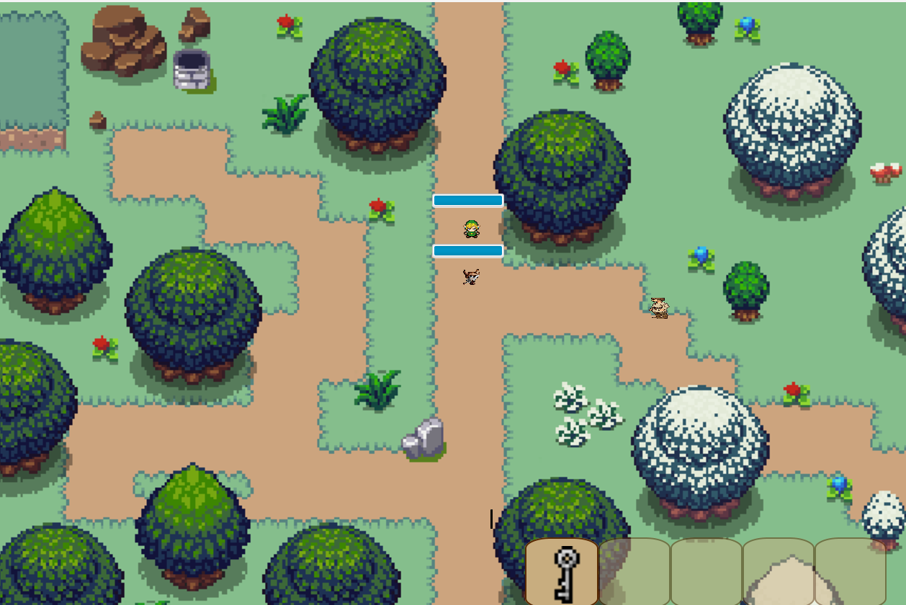

# Zelda B-O Hazard

- ## Descripyion


Le jeu se déroule dans un univers où l’on retrouve un monde majeur : le monde de la glace. Dans ce monde on retrouve une quête qui consiste à tuer un boss plus ou moins difficile à tuer avec ces sbires spécifiques et leurs propres attaques.
La quête principale est d'éradiquer tous les boss qui ont pris possession de l’univers et qui ont kidnappé la Princesse . 
Néanmoins dans la partie feu, résiste un village nommé Hazard où réside Link, notre joueur, qui n’a pas encore été conquis par le boss feu. Ce village est encore plein de vie et coloré. C’est ici que la mission commence. 


- ## Controle du jeu

Afin de faire apparaître le link, il faudra cliquer sur l'interface du jeu puis cliquer sur les touches suivantes en fonction de sa direction : 

- `D` : aller à droite
- `Q` : aller à gauche
- `Z` : aller en haut
- `S` : aller en bas
- `D` : changer de map
- `E` : ramasser une arme
- `G` : lacher une arme
- `A` : attaquer
 
Pour l'inventaire, on cliquera sur un chiffre compris entre 1 et 5 en fonction du placement de l'arme dans ce dernier.


- ## Captures d'Écran


### Menu




### Première Map




### Deuxième Map



### Technologies utilisées 

Zelda B-O Hazard a été développé en utilisant les technologies suivantes :

    Langage de programmation : Java
    Framework : JavaFX

Java a été utilisé pour la logique du jeu, la gestion des ennemis et des interactions avec l'utilisateur. JavaFX a été utilisé pour la création de l'interface utilisateur graphique, y compris les différentes pages du jeu et les éléments visuels tels que les images et les boutons.

### Installation

Pour exécuter le jeu, suivez les étapes ci-dessous :

Assurez-vous d'avoir Java Development Kit (JDK) installé sur votre système.

Téléchargez le fichier du jeu depuis.

```bash
git clone https://github.com/oumaimaekdo/Zelda-Oumaima_Nezha_Mehdy.git
```
Extrayez le contenu du fichier téléchargé dans un répertoire de votre choix.

Ouvrez une fenêtre de terminal ou une invite de commandes et accédez au répertoire où vous avez extrait les fichiers du jeu.

Compilez les fichiers Java en utilisant la commande suivante :

```bash
javac *.java
```
Une fois la compilation terminée, lancez le jeu en utilisant la commande suivante :

```bash
java Main
```
Le jeu se lancera et vous pourrez commencer à jouer en suivant les instructions à l'écran.

